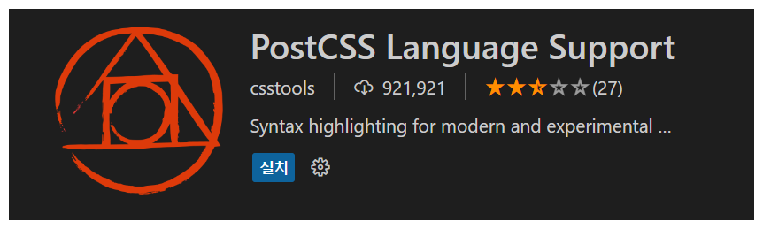

# Next.js + TailwindCss

- [Next.js + TailwindCss](#nextjs--tailwindcss)
  - [설치 방법](#설치-방법)
    - [1. postcss, autoprefixer와 함께 TailwindCss 설치](#1-postcss-autoprefixer와-함께-tailwindcss-설치)
    - [2. Tailwind configs 파일을 만들기 위한 초기화 command 입력](#2-tailwind-configs-파일을-만들기-위한-초기화-command-입력)
    - [3. 확장 프로그램 PostCSS Language Support 다운](#3-확장-프로그램-postcss-language-support-다운)
    - [4. Tailwind.configs.js](#4-tailwindconfigsjs)
    - [5. global.css에 @tailwind 추가](#5-globalcss에-tailwind-추가)
  - [적용 방법](#적용-방법)
    - [단위체계](#단위체계)
    - [원하는 단위 적용 방법](#원하는-단위-적용-방법)
    - [원하는 색 적용 방법](#원하는-색-적용-방법)
    - [레이아웃](#레이아웃)
    - [hover, focus, and active](#hover-focus-and-active)
  - [참조](#참조)


## 설치 방법

### 1. postcss, autoprefixer와 함께 TailwindCss 설치
```
npm install -D tailwindcss postcss autoprefixer
```

### 2. Tailwind configs 파일을 만들기 위한 초기화 command 입력
```
npx tailwindcss init -p
```
### 3. 확장 프로그램 PostCSS Language Support 다운



### 4. Tailwind.configs.js

Tailwind를 적용시킬 파일들의 path를 설정해준다.

```js
module.exports = {
  content: [
    "./pages/**/*.{js,ts,jsx,tsx}",
    "./components/**/*.{js,ts,jsx,tsx}",
  ]
  theme: {
    extend: {},
  },
  plugins: [],
}
```

### 5. global.css에 @tailwind 추가

```css
@tailwind base;
@tailwind components;
@tailwind utilties;
```

## 적용 방법


### 단위체계
기본적으로 단위를 명시적으로 적용하지 않았을 경우, **rem** 단위가 default이다. <br/>
1은 0.25rem, 4는 1rem이다.

<br/>

### 원하는 단위 적용 방법
기본적으로 대괄호 안에 적용하고 싶은 단위와 함께 넣어준다. <br/>
```css
w-[30px]  // width: 30px;
h-4 // height: 1rem;
```
<br/>

### 원하는 색 적용 방법
```css
bg-blue-500 // background: #3b82f6
bg-[#3b82f6] // background: #3b82f6
```

<br/>

### 레이아웃
- sm : @media (min-width:640px) 휴대폰 세로 사이즈
- md : @media (min-width:768px) 휴대폰 가로 사이즈
- lg : @media (min-width:1024px) 템플릿 사이즈
- xl : @media (min-width:1280px) 데스크탑 사이즈
```css
className="flex md:hidden gap-x-2 items-center"
```
<br/>

### hover, focus, and active
```js
<button class="bg-violet-500 hover:bg-violet-600 active:bg-violet-700 focus:outline-none focus:ring focus:ring-violet-300 ...">
  Save changes
</button>
```
## 참조
https://dosimpact.github.io/docs/g-fe/next/next006

https://tailwindcss.com/docs/installation